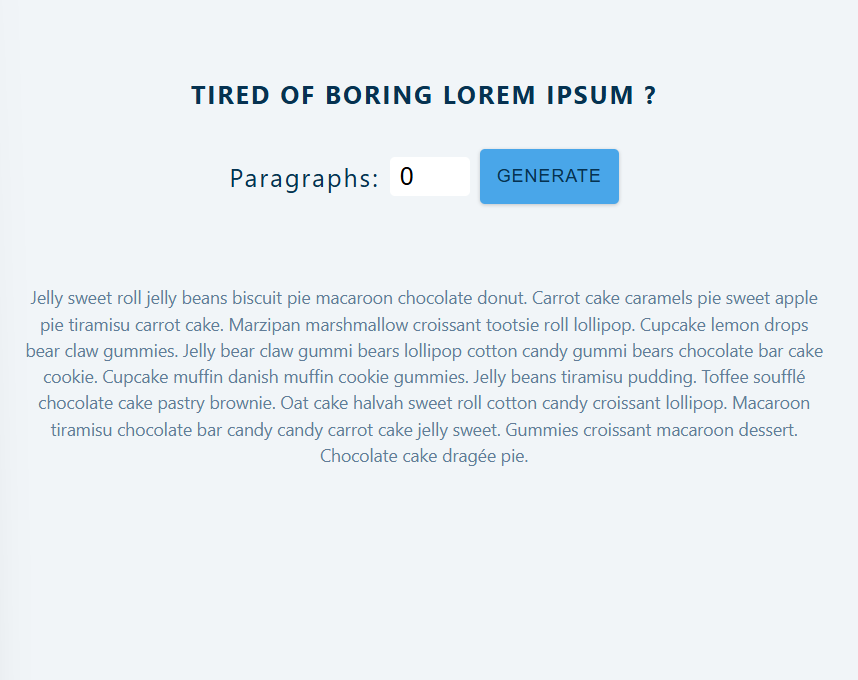

# lorem Generator

this project is used to create lorem 
based on the number of input the user 
entered

it use controled input it is type of 
number 

it also use Use state hooks to determine 
the text amount

it use slice method to set the number of paragraph

in the css section it defined Global and local css

# page looks likes

# thank you
# @copyRight Bisrat

# Dallas tx October 31 2021